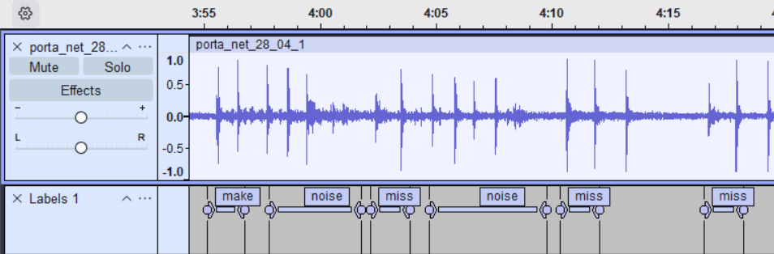
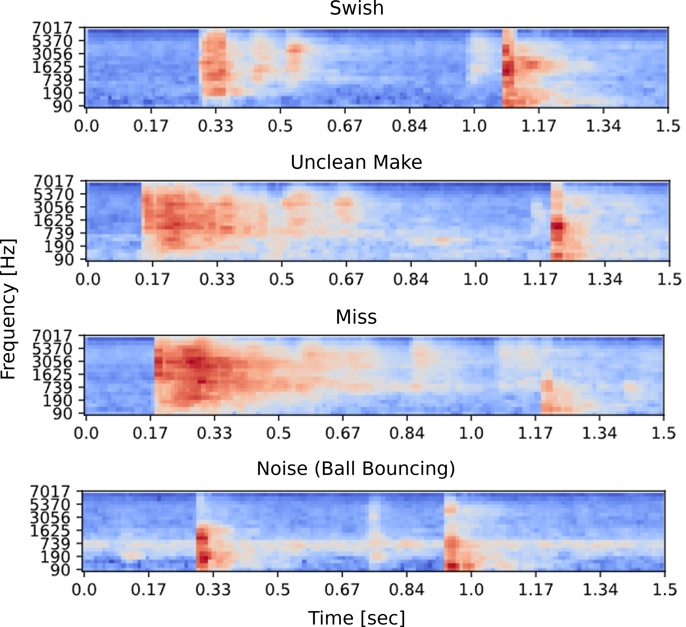
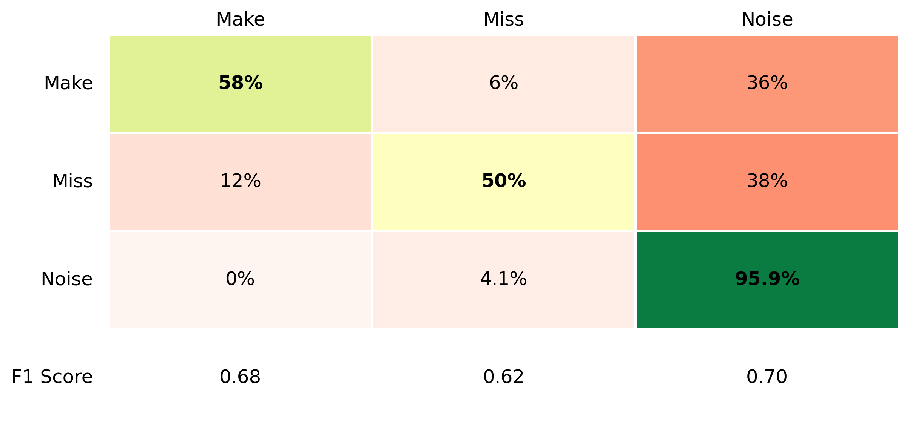

  

# Acoustic Classification of Basketball Shots using TinyML

**Author**: Elliot Hills

**Edge Impulse:** https://studio.edgeimpulse.com/public/979083/latest

**GitHub Repo:** https://github.com/tri4ngl3/CASA0018-Swish-Acoustic-Shot-Tracker/

**Experiment Logs, Code and Stats:** https://github.com/tri4ngl3/CASA0018-Swish-Acoustic-Shot-Tracker/experiment_logs_and_outputs

**Deployment Code:** https://github.com/tri4ngl3/CASA0018-Swish-Acoustic-Shot-Tracker/casa_deployment.ino

## Introduction
Tracking statistics from regular shooting drills is a key method that basketball players use to measure improvement in their shot (Cleary & Zimmerman, 2001). However, mentally tracking makes and misses is challenging and distracts from shooting form, as it creates a cognitive-motor dual-task that impairs performance (Moreira et al., 2021). Existing automated solutions predominantly consist of wearable tech (e.g. ShotTracker) and computer vision mobile apps (e.g. HomeCourt and Ballogy). However, while these technologies effectively automate data collection, they are imperfect. Wearable tech can impact a player's shot (Li and Zhang, 2022) and vision apps require setting up a phone on a tripod, which is impractical and can be seen as invasive in public spaces due to human by-catch (Sandbrook et al., 2018). 

This project, Swish, overcomes these problems by using machine learning to classify shots based on the sound of ball-basket interactions. By using audio, Swish bypasses the need for invasive filming or wearable hardware, providing a portable device that can be placed discretely under the rim, leaving the athlete to focus on their shot.

**Figure 1.** _The Swish shot tracker. **(A)** Deployment context. Positioning of the Swish sensor on the ground behind the court perimeter, beneath the hoop is shown. As well as the primary acoustic target zone (rim and net) and the downward propagation of sound to the microphone **(B)** Close-up of the assembled prototype detailing the components: (a) the **Arduino Nano 33 BLE Sense microcontroller**, (b) the **5V rechargeable battery**, (c) the **MP34DT05 microphone**, (d) the **RGB LED**, (e) the **custom fabric securement sleeve**, and (f) the **USB power cord** connecting the battery supply to the board._

## Application Overview
The Swish system employs an edge-computing architecture to process environmental audio locally in real-time. The hardware is lightweight and pocket-sized, simply consisting of an Arduino Nano 33 BLE Sense secured to a portable battery. Audio is continuously captured via the onboard MP34DT05 microphone and partitioned using a 1.5-second sliding window with a 0.5-second inference stride. 

Each window is processed through a Mel-filterbank energy (MFE) digital signal processing (DSP) block to convert the audio data into a 2D feature map. This is then passed to a quantised Convolutional Neural Network (CNN) classifier, which generates confidence scores for three target classes: make, miss, and noise. An algorithm then identifies the class with the highest score that exceeds the precision-recall tuned confidence threshold. If the window is classified as noise, the device continues listening. However, if a make or a miss is detected, then the respective event is recorded and a 2-second refractory period is initiated to prevent duplicate classifications. The onboard RGB LED then changes from blue, which indicates the device is listening, to red for a miss or green for a make. Shooting statistics are stored in local memory. This data can then be retrieved at the end of a session by connecting via a Bluetooth Low Energy (BLE) UART text interface that links the user's smartphone to the device using the Serial Bluetooth Terminal app.

**Figure 2.** *The Swish system architecture and data processing pipeline.*

## Data
Due to a scarcity of publicly available datasets for acoustic basketball shot classification, a custom dataset was constructed by recording shot audio at my local court. This ensured the training data was tailored to the intended deployment environment, capturing audio with a spatial arrangement relevant to device use by recording from the ground underneath the backboard.

Initially, data collection was carried out using the Arduino and Edge Impulse's (EI) labelling feature. However, this was abandoned due to restrictive 20-second recording limits and inefficient labelling workflow on EI. Instead, continuous shooting sessions, in which a diverse range of shots were taken, were recorded on a smartphone using the RecForge app. This app enabled me to record high resolution wav files and to mimic the Arduino mic's acoustic profile by disabling automatic gain control and using a single mic. Files were downsampled to 16,000 Hz (16 kHz) and noise was artificially added on EI to further mimic the arduino mic.

To streamline data annotation, delayed audio-tagging was used, whereby the class label was stated aloud following a pause after each shot. In Audacity, 1.5 second windows were labelled and audio tags removed in an efficient workflow that enabled the extraction of 1,509 data points total, including 353 makes, 572 misses and 584 background noise windows. 

**Figure 3.** *Audacity workspace demonstrating the manual audio annotation workflow. Over 2.5 hours of continuous raw shooting audio was segmented into discrete class windows using this method. Noise segments were intentionally left longer, allowing the Edge Impulse pipeline to automatically partition them into multiple 1.5-second windows.*

In order to correct class imbalance that skewed model predictions, misses were down-sampled to match the exact number of makes. Audio windows were then processed in EI into MFE feature maps ready for model training.

  

**Figure 4.** *MFE spectrograms illustrating the distinct acoustic profiles of a clean swish, an unclean make, a miss and background noise (ball bouncing) over a 1.5-second sample window.*

## Model & Experiments
### Model Architecture

Contructing a TinyML model means navigating the inherent trade-off balance between classification accuracy and processing efficiency (Lin et al., 2020).

To determine the optimal model for my device, I initially experimented with three architectures: a standard Dense Neural Network (DNN), a 1D Convolutional Neural Network (CNN), and a 2D CNN (Table 1). To prevent all models from overfitting, a high dropout rate was used between dense layers and noise injection and time-masking were employed to artificially expand the variance of the training dataset.

| Model Architecture | Validation Accuracy | Test Accuracy | Test F1 Score | Inference Latency |
| :--- | :--- | :--- | :--- | :--- |
| **Dense (DNN)** | 60.3% | 53.38% | 0.53 | 10 ms |
| **1D CNN** | 86.4% | 78.70% | 0.91 | 13 ms |
| **2D CNN** | 87.7% | 83.46% | 0.92 | 144 ms |

**Table 1.** *Performance metrics across neural network architectures.*

The DNN performed poorly, achieving only 53.38% test accuracy, likely because flattening the spectrogram destroyed the spatial information required to distinguish between classes. The CNNs performed significantly better, with the 2D architecture slightly outperforming the 1D model across all evaluation metrics. The 1D CNN exhibited a notably lower test accuracy, which confusion matrix analysis revealed was primarily driven by a higher proportion of 'uncertain' classifications compared to 2D. [could include why] However, the 1D CNN was significantly more efficient, executing inference in just 13 ms compared to the 2D CNN at 306 ms. 

Navigating this accuracy-latency trade-off required prioritizing the specific functionality of the application. To operate effectively as a shot tracker, Swish must have a high classification accuracy to reliably capture the minute, incremental improvements a player makes to their shooting percentage over time. As a result, the 1D architecture was deemed insufficiently accurate for the use case and it was decided that the 2D CNN should be used, so long as further system optimisation could ensure total latency remained below the 500 ms inference stride.

### Edge Optimisation

In the baseline system using auto-tuned parameters from Edge Impulse (16KHz, 40 filters, 512 FFT length, 0.01s stride), the MFE processing block had a high latency of 763 ms. Combined with the 306 ms inference time, the total pipeline latency far exceeded the 500 ms inference stride constraint at 1,069 ms.

To resolve this, three experiments were run to evaluate the effect of downgrading parameters (Table 2): 
1. Downsampling the audio sample rate
2. Reducing the temporal resolution
3. Reducing the DSP frequency resolution

Downgrading these parameters reduces the computational load of feature extraction and shrinks the output spectrogram dimensions, creating a subsequent reduction in downstream inference latency. However, it also reduces model accuracy.

| Experiment | Parameter Adjusted | Processing Latency | Inference Latency | Total Latency | Test Accuracy |
| :--- | :--- | :--- | :--- | :--- | :--- |
| **Baseline** | None (16KHz, 40 filters, 512 FFT, 0.01s stride) | 763 ms | 306 ms | 1,069 ms | 83.46% |
| **Downsampling** | Sample rate: 16KHz &rarr; 8KHz | 733 ms | 274 ms | 1,007 ms | 77.19% |
| **Time Resolution** | Frame stride: 0.01s &rarr; 0.02s | 381 ms | 100 ms | 481 ms | 76.60% |
| **DSP Resolution** | Filters: 40 &rarr; 20, FFT: 512 &rarr; 256 | 386 ms | 105 ms | **491 ms** | **79.20%** |

**Table 2.** *Impact of MFE processing block optimizations on system latency and test accuracy.*

Downsampling to 8KHz provided a negligible latency improvement, while degrading accuracy. Conversely, decreasing the temporal resolution by doubling the frame stride successfully reduced total latency to below 500 ms at 481 ms, but had significantly reduced accuracy (76.60%).

Ultimately, the DSP resolution downgrade was selected as the optimal deployment configuration. By reducing the number of mel-filters to 20 and halving the FFT length to 256, the vertical frequency resolution of the spectrogram was compressed. This achieved a total latency of 491 ms, while retaining a high test accuracy (79.20%).

### Real-World Validation
To evaluate the model on-device, a 150-shot data set including 50 noise, 50 miss and 50 make events was collected. While the model accuracy in this deployment test decreased to 67.3%, results showed that the sensor was robust to background noise with a 95.9% true negative rate (Figure 5). Furthermore, when the model detected a shot, it successfully distinguished between makes and misses, with an average misclassification rate of only 9%.

However, there was a significant false-negative rate, with over a third of valid shot events (36% of Makes and 38% of Misses) incorrectly classified as noise. This failure is primarily attributed to environmental domain shift. The training dataset was recorded over 3 windy afternoons, with one falling on the same day as the London Marathon, only 100 meters away. This likely embedded a high ambient noise floor so when the model was deployed on a quiet, low-wind day, the quieter swish and rim sounds failed to overcome inference thresholds, causing the model to incorrectly default to noise classifications.

  

**Figure 5.** *Confusion matrix of the real-world classification performance across 150 acoustic events. Results processed using experiment_logs_and_outputs/deployment_test.py*

## Discussion

The Swish device serves as a viable proof-of-concept for the application of TinyML to basketball shot tracking using audio. Achieving a 79.2% model test accuracy and a 67.3% deployment accuracy - despite a limited dataset and domain shift in the real-world test - validates the ability of edge models to acoustically differentiate basketball shot outcomes. Furthermore the Swish system functioned smoothly in deployment with latency challenges navigated effectively. The bluetooth stats retrieval and RGB LED live shot-classification also proved successful making Swish an intuitive, user-friendly device.

However, for this device to graduate from a prototype to a commercial device that is fit-for-purpose, accuracy must be improved greatly if it is to track the minute FG% changes that occur from session-to-session as basketball players improve their shot. This of course can be addressed by gathering significantly more data, however the domain shift identified in deployment also highlighted the need for greater diversity in training data. By collecting further data from diverse environments with a variety of background noise levels and types and from court variations (e.g. chain nets, indoor courts, different backboards) future model iterations will be more robust and widely applicable for use in the real world.

Another pitfall that limits Swish's broader applicability is the inability for the model to track shots that neither make contact with the rim nor the net. Although these are uncommon in the intended use-case of regular shooting drills, they can occur, especially from beginners. Detecting these 'airballs' purely acoustically is perhaps an insurmountable challenge, as without an impact sound they are indistinguishable from background ball bounces. This also applies to rims without nets, which are common in many public outdoor courts. Expanding the Swish system to include these shots may require multi-modal sensor fusion such as a rim-attachable motion sensor.  

Furthermore, while device build provided adequate short-term durability as a prototype, a weatherproof, impact-resistant 3D-printed enclosure is necessary for longer-term use. Finally, the system's utility could be  enhanced by developing a companion app to allow players to map their shooting percentages to specific court locations by following preset drills, elevating Swish to a training tool.

## Conclusion
This project successfully developed and deployed Swish, a TinyML-powered acoustic shot tracker. The system achieved a 79.2% test accuracy and a 67.3% accuracy in real-world testing. It demonstrated a robust 95.9% rejection rate for background noise and successfully distinguished between makes and misses. While environmental domain shift in testing highlighted the need for a more diverse training dataset, the prototype showed that edge-based acoustic classification is a viable alternative to existing shot tracking technologies and demonstrated a user-friendly pipeline for its implementation.

## Bibliography
1. Cleary, T. J., & Zimmerman, B. J. (2001). Self-regulation differences during athletic practice by experts, non-experts, and novices. Journal of applied sport psychology, 13(2), 185-206.
2. Li, S., & Zhang, W. (2022). Evaluation Method of Basketball Teaching and training effect based on Wearable device. Frontiers in Physics, 10, 900169.
3. Lin, J., Chen, W. M., Lin, Y., Gan, C., & Han, S. (2020). Mcunet: Tiny deep learning on iot devices. Advances in neural information processing systems, 33, 11711-11722.
4. Moreira, P. E. D., Dieguez, G. T. D. O., Bredt, S. D. G. T., & Praça, G. M. (2021). The acute and chronic effects of dual-task on the motor and cognitive performances in athletes: a systematic review. International journal of environmental research and public health, 18(4), 1732.
5. Sandbrook, C., Luque-Lora, R., & Adams, W. M. (2018). Human bycatch: Conservation surveillance and the social implications of camera traps. Conservation and Society, 16(4), 493-504.

----

## Declaration of Authorship

I, Elliot Hills, confirm that the work presented in this assessment is my own. Where information has been derived from other sources, I confirm that this has been indicated in the work.

*Elliot Hills*

05/05/2026 (DAP used)

Word count: 
