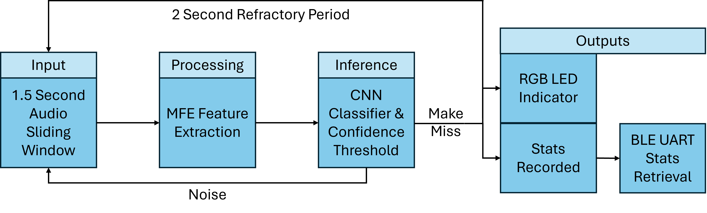

# Swish: Real-Time Acoustic Classification of Basketball Shots using TinyML

**Author**: Elliot Hills

**Edge Impulse:** https://studio.edgeimpulse.com/public/92154/latest

**GitHub Repo:** https://github.com/mandymadongyi/Baby-Cry-Detector-CASA0018

## Introduction

Tracking statistics from regular shooting drills is a key method that basketball players use to measure improvement in their shot (Cleary & Zimmerman, 2001). However, mentally tracking makes and misses is challenging and distracts from shooting form, as it creates a cognitive-motor dual-task that inherently impairs performance (Moreira et al., 2021). Existing automated solutions predominantly consist of wearable tech (e.g. ShotTracker) and computer vision mobile apps (e.g. HomeCourt and Ballogy). However, while these technologies effectively automate data collection, they are imperfect. Wearable tech can impact a player's shot (Li and Zhang, 2022) and vision apps require setting up a phone on a tripod, which is impractical and can be seen as invasive in public spaces due to human by-catch (Sandbrook et al., 2018). 

This project, Swish, overcomes these problems by using machine learning to classify shots based on the sound of ball-basket interactions. By using audio, Swish bypasses the need for invasive filming or wearable hardware, providing a portable device that can be placed discretely under the rim, leaving the athlete to focus on their shot.

(insert diagram image of swish under the rim)

## Application Overview

The Swish system employs an edge-computing architecture to process environmental audio locally in real-time. The hardware is lightweight and pocket-sized, simply consisting of an Arduino Nano 33 BLE Sense secured to a portable battery. Audio is continuously captured via the onboard MP34DT05 microphone and partitioned using a 1.5-second sliding window with a 0.5-second inference stride. 

Each window is processed through a Mel-filterbank energy (MFE) digital signal processing (DSP) block to convert the audio data into a 2D feature map. This is then passed to a quantised Convolutional Neural Network (CNN) classifier, which generates confidence scores for three target classes: make, miss, and noise. An algorithm then identifies the class with the highest score that exceeds the precision-recall tuned confidence threshold. If the window is classified as noise, the device continues listening. However, if a make or a miss is detected, then the respective event is recorded and a 2-second refractory period is initiated to prevent duplicate classifications. The onboard RGB LED then changes from blue, which indicates the device is listening, to red for a miss or green for a make. Shooting statistics are stored in local memory. This data can then be retrieved at the end of a session by connecting via a Bluetooth Low Energy (BLE) UART text interface that links the user's smartphone to the device using the Serial Bluetooth Terminal app.

**Figure 2.** *Block diagram detailing the Swish system architecture and data processing pipeline.*

## Data
Due to a scarcity of publicly available datasets for acoustic basketball shot classification, a custom dataset was constructed by recording shot audio at my local court. This ensured the training data was tailored to the intended deployment environment, capturing audio with a spatial arrangement relevant to device use by recording from the ground underneath the backboard.

Initally, data collection was carried out using the Arduino and Edge Impulse's (EI) labelling feature. However, this was abandoned due to restrictive 20-second recording limits and inefficient labelling workflow on EI. Instead, continuous shooting sessions, in which a diverse range of shots were taken, were recorded on a smartphone using the RecForge app. This app enabled me to record high resolution wav files and to mimic the Arduino mic's acoustic profile by disabling automatic gain control and using a single mic. 

*Tip: probably ~200 words and images of what the data 'looks like' are good!*

## Model
This is a Deep Learning project! What model architecture did you use? Did you try different ones? Why did you choose the ones you did?

*Tip: probably ~200 words and a diagram is usually good to describe your model!*

## Experiments
What experiments did you run to test your project? What parameters did you change? How did you measure performance? Did you write any scripts to evaluate performance? Did you use any tools to evaluate performance? Do you have graphs of results? 

Run a deployment accuracy test??

*Tip: probably ~300 words and graphs and tables are usually good to convey your results!*

## Results and Observations
Synthesis the main results and observations you made from building the project. Did it work perfectly? Why not? What worked and what didn't? Why? What would you do next if you had more time?  

*Tip: probably ~300 words and remember images and diagrams bring results to life!*

## Conclusion
Wrap it up, summarising key findings.

*Tip: probably ~100 words*

## Bibliography
*If you added any references then add them in here using this format:*

1. Last name, First initial. (Year published). Title. Edition. (Only include the edition if it is not the first edition) City published: Publisher, Page(s). http://google.com

2. Last name, First initial. (Year published). Title. Edition. (Only include the edition if it is not the first edition) City published: Publisher, Page(s). http://google.com

https://www.fatherly.com/gear/shottracker-wearable-basketball-sensor
https://www.homecourt.ai/
https://www.ballogy.com/

Cleary, T. J., & Zimmerman, B. J. (2001). Self-regulation differences during athletic practice by experts, non-experts, and novices. Journal of applied sport psychology, 13(2), 185-206.
Sandbrook, C., Luque-Lora, R., & Adams, W. M. (2018). Human bycatch: Conservation surveillance and the social implications of camera traps. Conservation and Society, 16(4), 493-504.
Moreira, P. E. D., Dieguez, G. T. D. O., Bredt, S. D. G. T., & Praça, G. M. (2021). The acute and chronic effects of dual-task on the motor and cognitive performances in athletes: a systematic review. International journal of environmental research and public health, 18(4), 1732.
Li, S., & Zhang, W. (2022). Evaluation Method of Basketball Teaching and training effect based on Wearable device. Frontiers in Physics, 10, 900169.

*Tip: we use [https://www.citethisforme.com](https://www.citethisforme.com) to make this task even easier.* 

----

## Declaration of Authorship

I, AUTHORS NAME HERE, confirm that the work presented in this assessment is my own. Where information has been derived from other sources, I confirm that this has been indicated in the work.

*Digitally Sign by typing your name here*

ASSESSMENT DATE

Word count: 
